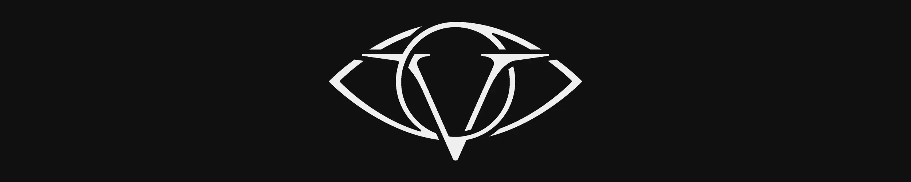

# VISCERIUM

> **One timeline. Four eras. Infinite stories.**

**Licensing summary:** VISCERIUM's creative universe is proprietary and all rights reserved. Original first-party software is open source under the MIT License. Third-party components remain governed by their respective upstream licences.

VISCERIUM is a dark transmedia universe built across one continuous history.

On Errack, within the shadow-veiled Degel System, humanity survives a world of lethal beauty, inherited warfare, occult power, and abominable incursions. Resonance can reshape matter and reality, but every use carries consequences. Kingdoms become republics. Rituals become sciences. Fortress walls become orbital defences.

**The world advances. The struggle does not.**

## Four eras. One wounded history.

| Era | The world at that moment |
| --- | --- |
| **[CITADEL](https://www.viscerium.co.uk/eras/citadel/)** | Steel, bone, siegecraft, and early gunpowder. Horrors are still mistaken for folklore. |
| **[SMOG](https://www.viscerium.co.uk/eras/smog/)** | Industry, trenches, and occult machinery. Civilisation industrialises war faster than it learns from it. |
| **[NEARSIGHT](https://www.viscerium.co.uk/eras/nearsight/)** | Satellites, exoskeletons, and cassette futurism. Humanity believes the world is finally observable. |
| **[ENTROPY](https://www.viscerium.co.uk/eras/entropy/)** | Orbital war, altered flesh, and extinction pressure. The old struggle escapes the planet. |

These are not separate settings. Each era inherits the damage, discoveries, cultures, lies, and unfinished conflicts of the one before it.

## Enter the Codex

The **[VISCERIUM Codex](https://www.viscerium.co.uk/)** is the public archive of the setting: its peoples, creatures, factions, histories, technologies, mysteries, and connected timeline.

- **[Start Here](https://www.viscerium.co.uk/start-here/)**: the guided introduction to VISCERIUM and the Degel System.
- **[Explore the timeline](https://www.viscerium.co.uk/timelines/super/)**: trace the events that connect all four eras.
- **[Browse the Codex](https://www.viscerium.co.uk/)**: choose an era and enter the world directly.

## What lives in this repository

This repository contains both the source archive and the machinery behind the public Codex.

- `Vault/` contains the Obsidian worldbuilding vault and source Lore.
- `Site/` contains the Astro and Starlight website.
- `Tools/` contains creator-facing tools and integrations.
- `Architecture/` documents the systems that connect the vault, generators, and public site.

The public website is generated from reviewed, published source notes. The repository is therefore not only a website project; it is the working infrastructure for a growing fictional universe.

## Creation, authorship, and rights

**Fall — Founder and Creator of VISCERIUM**

> **VISCERIUM was created and authored by Fall. Its published lore and creative canon are human-made and are not generated by AI.**

The current creative-rights notice is:

<!-- RIGHTS:VISCERIUM_CURRENT:START -->
> **VISCERIUM created by Fall. © 2021–2026 Fall. All rights reserved.**
<!-- RIGHTS:VISCERIUM_CURRENT:END -->

NULL Holdings Ltd is the intended future IP-holding company for VISCERIUM. It has not yet been incorporated, and no VISCERIUM rights have been assigned to it.

The planned role upon incorporation is:

> **Fall — Founder and Creator of VISCERIUM; Founder and Group Creative Director of NULL Holdings Ltd.**

After incorporation and a formal written assignment, the intended creative-rights notice is:

<!-- RIGHTS:VISCERIUM_PLANNED:START -->
> **VISCERIUM created by Fall. © 2021–2026 NULL Holdings Ltd. All rights reserved.**
<!-- RIGHTS:VISCERIUM_PLANNED:END -->

### Creative material

VISCERIUM Lore, canon, fiction, articles, artwork, maps, characters, factions, branding, and other original creative material remain proprietary and all rights reserved.

Public access does not place that material in the public domain or grant permission to reproduce, adapt, distribute, commercially exploit, or use it as generative-AI training material.

### Software

Original first-party website code, build scripts, tests, and VISCERIUM creator-tool code are open source under the **[MIT License](LICENSE-CODE.md)**.

That software licence does not grant rights to VISCERIUM's Lore, artwork, maps, branding, canon, or other creative assets processed or displayed by the software.

Astro, Starlight, Obsidian integrations, map tools, graph tools, timeline libraries, search libraries, fonts, and other third-party components remain subject to their respective upstream licences. See **[THIRD_PARTY_NOTICES.md](THIRD_PARTY_NOTICES.md)**.

Read **[LICENSE.md](LICENSE.md)** for the full repository licence map and **[ATTRIBUTION.md](ATTRIBUTION.md)** for creator and contributor credit.

## Get involved

VISCERIUM is intended to grow through readers, players, artists, writers, developers, and other collaborators who care about deep worlds and strong creative identity.

### Improve the Codex

Report typos, broken links, content corrections, site bugs, or feature ideas through **[GitHub Issues](https://github.com/Bladeswillfall/VISCERIUM/issues)** or the **[support page](https://www.viscerium.co.uk/support/)**.

### Contribute to the repository

Code, documentation, accessibility, tooling, testing, and interface improvements are welcome through pull requests. Read **[CONTRIBUTING.md](CONTRIBUTING.md)** before changing the repository.

Opening a pull request does not transfer copyright or make a contribution part of VISCERIUM canon. Accepted code contributions to MIT-covered paths are distributed under the repository's MIT software licence. Creative canon contributions require separate written contributor terms before acceptance.

### Propose a creative collaboration

For writing, artwork, games, animation, film, rights, credit, or other collaboration discussions, use the **[contact page](https://www.viscerium.co.uk/contact/)**. If private contact is paused, use GitHub for non-sensitive proposals and keep confidential details out of public issues.

VISCERIUM remains a curated setting. Suggestions and contributions are reviewed for continuity, quality, tone, and technical fit before they become part of the published Codex.

## Maintainer documentation

Operational instructions have been moved out of this front page.

- **Creators:** start in **[`Vault/Home.md`](Vault/Home.md)**.
- **Repository operations:** use the **[Creator Command Reference](Vault/System/SOPs/Creator%20Command%20Reference.md)** for exact commands and working directories.
- **Contributors:** start with **[CONTRIBUTING.md](CONTRIBUTING.md)**.
- **[Repository licence map](LICENSE.md)**
- **[Open-source code licence](LICENSE-CODE.md)**
- **[Third-party notices](THIRD_PARTY_NOTICES.md)**
- **[Attribution and creator credit](ATTRIBUTION.md)**
- **[Standard Operating Procedures](Vault/System/SOPs/SOP%20Index.md)**
- **[Codex Publishing and Deployment SOP](Vault/System/SOPs/Codex%20Publishing%20and%20Deployment%20SOP.md)**
- **[Architecture Guide](Architecture/README.md)**
